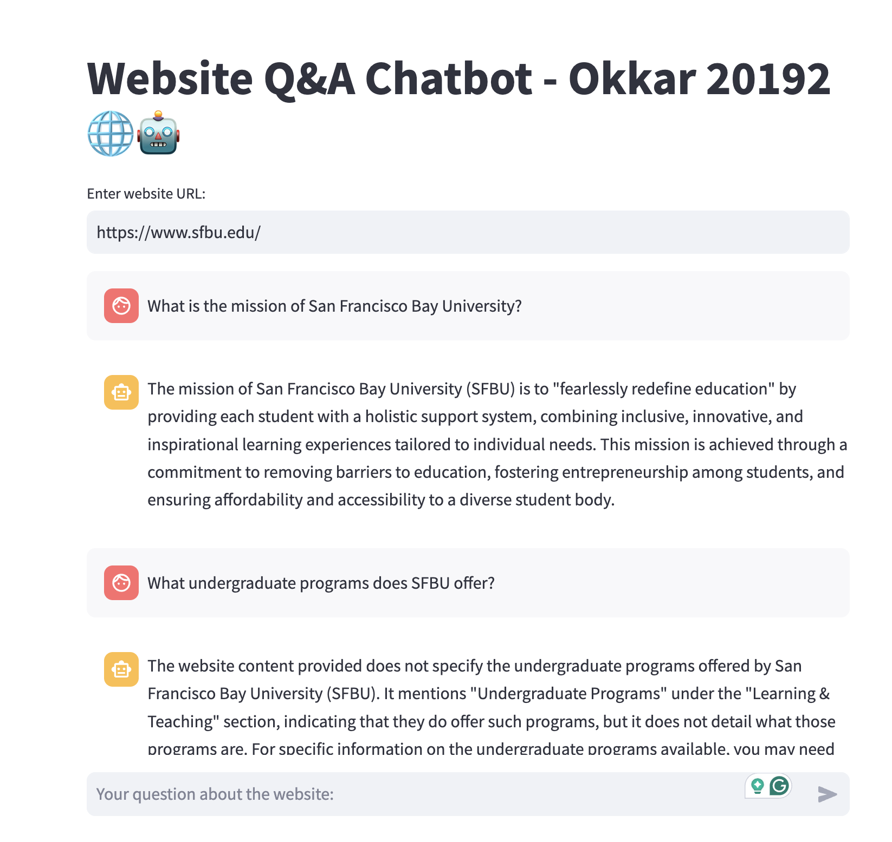

# AI-Powered Website Q&A Chatbot

This project is an AI-powered chatbot that can answer questions about website content using natural language processing and machine learning techniques.



## Additional Documents

- Presentation (Google Slides): https://docs.google.com/presentation/d/1PYRNkSy3sqXc3wjRuNA_lrdcSfNS0k0x5MFGJ8tT85Q/edit?usp=drive_link
- Presentation (PDF): https://drive.google.com/file/d/1Fvdqufsx6_FoYGChsz69t2PlxTpxZxLR/view?usp=drive_link

## Features

- Web scraping to extract content from user-specified URLs
- Natural language processing for understanding user queries
- AI-powered response generation using GPT-4 model
- User-friendly interface built with Streamlit

## Installation

1. Clone the repository:
   ```
   git clone https://github.com/Absorber97/ai-website-qa-chatbot.git
   cd ai-website-qa-chatbot
   ```

2. Create a virtual environment and activate it:
   ```
   python -m venv venv
   source venv/bin/activate  # On Windows, use `venv\Scripts\activate`
   ```

3. Install the required dependencies:
   ```
   pip install -r requirements.txt
   ```

4. Set up your environment variables:
   Create a `.env` file in the project root and add your OpenAI API key:
   ```
   OPENAI_API_KEY=your_api_key_here
   ```

## Usage

Run the Streamlit app:
```
streamlit run src/ui/streamlit_app.py
```

Open your web browser and go to the URL provided by Streamlit (usually `http://localhost:8501`).

## Project Structure

- `src/core/website_qa.py`: Core functionality for web scraping and AI-powered Q&A
- `src/ui/streamlit_app.py`: Streamlit-based user interface
- `src/utils/helpers.py`: Utility functions
- `.env`: Environment variables (not tracked by Git)
- `requirements.txt`: Python dependencies

## Contributing

Contributions are welcome! Please feel free to submit a Pull Request.

## Helpful Resources

- Chatbot with GPT-4o Mini & Streamlit: https://pub.towardsai.net/openai-api-from-basics-to-chatbot-implementation-with-gpt-4o-mini-streamlit-1c4de9c3c311
- AI Summarizer with Streamlit: https://python.plainenglish.io/how-to-develop-an-ai-summarizer-and-chatbot-platform-with-streamlit-9b1598c55a43
- OpenAI API Documentation: https://platform.openai.com/docs/overview
- Streamlit Documentation: https://docs.streamlit.io/

## License

This project is licensed under the MIT License - see the [LICENSE](LICENSE) file for details.

## Troubleshooting

If you encounter any import errors:
1. Make sure you've activated the virtual environment.
2. Ensure all required packages are installed: `pip install -r requirements.txt`
3. If using an IDE, set the Python interpreter to the one in your virtual environment.

## Contact

For any questions or feedback, please open an issue on the GitHub repository.
